## Azure Cosmos DB

Esta es una  base es rapida.

- **Modelo de servicio:** PaaS.
- **Que es:** Base de datos no estructurada  y NoSQL.
- **Caracteristicas:** Guardado de datos rapido.
- **Caracteristicas:** Soporta MongoDB, Cassandra, Gemlin.
- **Caracteristicas:** Puede hacer consultas con SQL.
- **Cuando usar:** Para hacer consultas e insersiones muy rapidas.

---------------------------------------------------------------------------------------------------------------------------

### Pasos para crear un Cosmos DB

1.- Abrimos el [Portal Azure](portal.azure.com)

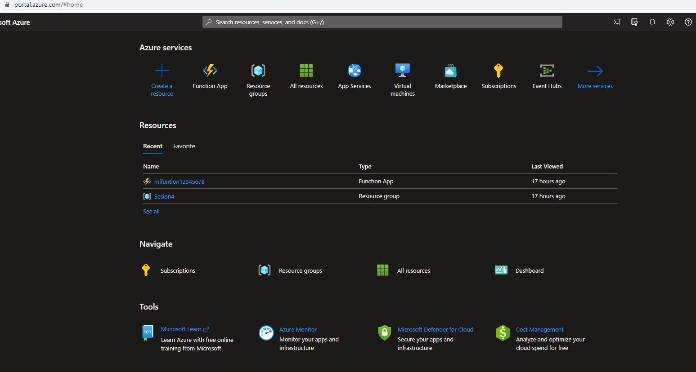

2.- Buscamos Cosmos DB.

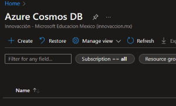

3.- Creamos un Cosmo DB.

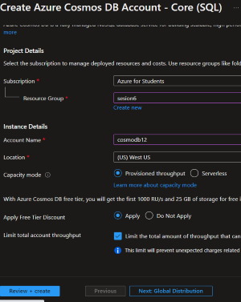

4.- Nos dara varias opciones ara crear la base, vamos a crear la que dice **Nucleo SQL**.

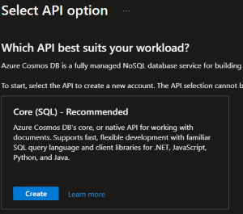

5.- Ahora,le daremos en explorador de datos abiertos.

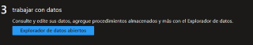

6.- Del lado izquierdo podremos observa que esta el archivo y estan los items, 
no aparece nada por que no le hemos agregado nada.

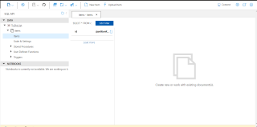

11.- Para agregarle un item, le daremos donde dice **New item** 

12.- Y vamos escribiendo la variable y lo que contiene cada variable (osea vamos creando los items), una ves que acabemos, debemos darle en **save**.

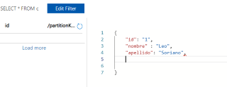

13.- Al darle save, no crea algo que es solo de uso interno de **cosmos**.

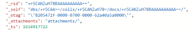

14.- Para crear otro, debemos darle de nuevo en **Nuevo item** y copiamos lo que ya habiamos puesto, modificando que sea el item numero 2 y agregando otro dato mas.

15.- Le damos Save y podemos ver del lado izquiero que donde dice **id** ya aparece el 1 y el 2.

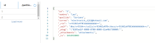

16.- Ahora nos iremos a New SQL Query (Consulta)  y le diremos que nos muestre la numero 1.

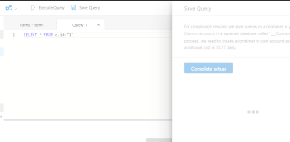

17.- Pondremos el comando **SELECT*FROM c WHERE c.id="1"**, despues le daremos a que se guarde el Query por lo que nos cobrara.
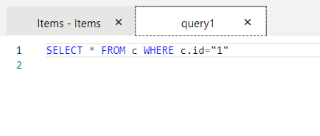
18.- Una ves que se guarde, le daremos en **Execute Query** y podremos ver lo que pusimos en el item 1.
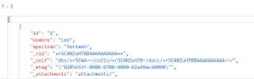
19.- Y esto es **COSMOS DB**.

-----------------------------------------------------------------------------------------------------------------------------------
